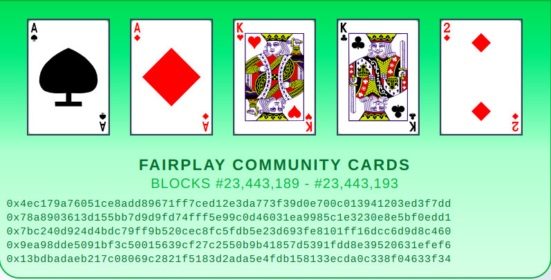

After about a month of casually #BUIDLing on top of the knowledge and experience of the world-class Farcaster team; the day has finally arrived to kick the tires on my 1st Frame/MiniApp.

Could there possibly be a better day to launch a NEW app, on a brand NEW platform, than Friday the 13th? __Surely not .. LET'S GO!__

<!-- truncate -->

Simply add Markdown files (or folders) to the `blog` directory.

Regular blog authors can be added to `authors.yml`.

Here are a few tips you might find useful.

:::danger

This is an __ALPHA__ launch for very early testers.

Mostly, this is me needing to actually __SEE__ how this all works on a __LIVE__ platform. Which is necessary, so I can effectively continue development of this application _(plus other games already in the works)_.

:::

# Provably Fair

Cast Poker is 100% provably fair. Each respective blockchain controls the outcome of the cards that are dealt to the community and the individual players.

# User Interface

The user interface (UI) is very simple.

Take a look at the [__Smart Contracts__](/contracts) for more info on how this game was built.
